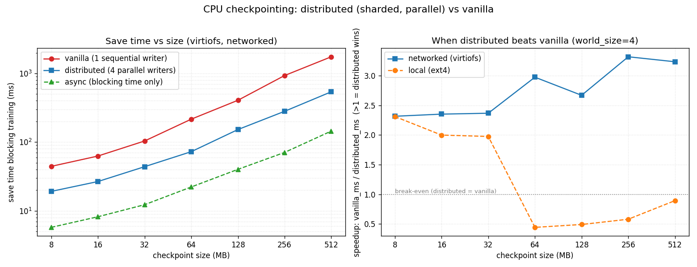

# Module 2 Homework: CPU Checkpointing and Reproducible Training Logs

In this homework you implement and exercise three checkpointing strategies for
a tiny PyTorch training job that runs **CPU-only** on a synthetic dataset, then
demonstrate **resume from checkpoint**. The job is intentionally tiny and
finishes in seconds.

## Rules

- **Do not modify** `module_2/README.md`, `module_2/code/`, or `module_2/assets/`.
  Those are the lecture materials.
- Do your work in **`module_2/HW-code/`** (the starter) and commit your results
  into **`module_2/HW-solution/`**.
- The outputs you commit must be **real**, produced by running the job on the
  CPU cluster — not hand-written.

## What you build

`module_2/HW-code/train_cpu_checkpoint.py` already trains a small MLP on a
synthetic regression dataset. You only need to fill in the four functions
marked `# YOUR CODE HERE`:

| Function                        | What it does |
|---------------------------------|--------------|
| `save_vanilla_checkpoint`       | One synchronous `torch.save` of the full state to `checkpoints/vanilla/vanilla_step_<step>.pt`. |
| `save_async_checkpoint`         | Snapshot the state and write it from a **background thread** to `checkpoints/async/async_step_<step>.pt`; return `(path, thread)`. |
| `save_distributed_checkpoint`   | Shard the model parameters round-robin across fake ranks into `checkpoints/distributed/step_<step>/shard_<rank>.pt` plus a `meta.json`. |
| `load_checkpoint`               | Load a vanilla checkpoint and return its state dict. |

## How to run (on the CPU cluster)

```bash
# one-time environment setup
python3 -m venv .venv && source .venv/bin/activate
pip install --index-url https://download.pytorch.org/whl/cpu torch
pip install numpy

# from module_2/HW-code, populate module_2/HW-solution/ with real outputs
cd module_2/HW-code
./submit-cpu-checkpoint.sh
```

The script also **times each checkpoint strategy** (how long it blocks the
training loop) and writes the comparison to `log.txt` (`CHECKPOINT_TIMING` /
`CHECKPOINT_TIMING_SUMMARY`), to `metrics.json` (`checkpoint_timings`) and to
`final_report.json` (`checkpoint_timing_summary`, incl. `least_blocking_mode`).
The timing harness lives in the provided `main()` — you don't implement it.

`submit-cpu-checkpoint.sh` is plain bash. It runs the training **twice**:
1. a fresh run up to step 20 that writes all three checkpoint kinds, then
2. a `--resume` run that loads the vanilla step-20 checkpoint and continues to
   step 40.

> The submit script does **not** use Slurm/Kubernetes/`srun`/`sbatch` and does
> **not** SSH anywhere. Run it directly on the machine you want to train on.

## When does `distributed` beat `vanilla`?

On the tiny training model, a single `vanilla` `torch.save` is the fastest —
sharding only adds per-file overhead. `distributed` (sharded) checkpointing
wins once **(1)** the state is large enough that write time dominates and
**(2)** the shards are written **concurrently** to storage with parallel
bandwidth (a networked/parallel filesystem). `bench_checkpoint_io.py`
demonstrates this crossover: it writes a large synthetic checkpoint with each
strategy and records the result in `checkpoint_io_benchmark.json`, e.g. on the
cluster's networked home (`scratch_fs: virtiofs`) a 256 MB checkpoint sharded
across 4 concurrent writers is ~2× faster than one sequential vanilla write.
On a local single disk the speedup mostly disappears (bandwidth-bound).

Run it yourself (tune with `BENCH_MB` / `BENCH_WORLD` / `BENCH_REPS`):

```bash
python bench_checkpoint_io.py --out ../HW-solution --mb 256 --world-size 4
```

To see the whole crossover curve, sweep several sizes (optionally on two
storage backends) and plot it (needs `matplotlib`):

```bash
# networked / parallel storage (e.g. the cluster home)
python bench_checkpoint_io.py --out ../HW-solution --sweep 8,16,32,64,128,256,512 --world-size 4
# local disk, for comparison
python bench_checkpoint_io.py --out ../HW-solution --scratch /tmp/ckpt_io_bench \
    --sweep 8,16,32,64,128,256,512 --world-size 4
mv ../HW-solution/checkpoint_io_sweep.json ../HW-solution/checkpoint_io_sweep_local.json
# re-run the networked sweep, then plot both
python bench_checkpoint_io.py --out ../HW-solution --sweep 8,16,32,64,128,256,512 --world-size 4
python plot_checkpoint_io.py
```



The measured result on the cluster: on **networked** storage (`virtiofs`)
distributed is ~2–3.5× faster across all sizes; on a **local** disk it only
wins for small checkpoints and *loses* past ~64 MB (concurrent writers just
contend for one disk's bandwidth). So "distributed beats vanilla" is really a
statement about having parallel write bandwidth, not about sharding alone.

## Expected outputs (committed under `module_2/HW-solution/`)

```
module_2/HW-solution/
  train_cpu_checkpoint.py        # your completed solution (no placeholders)
  log.txt                        # has markers START_TRAINING / SAVED_CHECKPOINT /
                                 #   RESUMED_FROM_CHECKPOINT / FINISHED_TRAINING
  metrics.json                   # { losses, start_step, end_step,
                                 #   resumed_from_checkpoint, checkpoint_timings }
  final_report.json              # { status:"ok", resumed_from_checkpoint:true,
                                 #   total_steps>=30, final_loss, checkpoint_path,
                                 #   checkpoint_timing_summary, ... }
  checkpoints/
    vanilla/vanilla_step_*.pt
    async/async_step_*.pt
    distributed/step_*/shard_*.pt + meta.json
  checkpoint_io_benchmark.json    # single-point I/O benchmark (256 MB)
  checkpoint_io_sweep.json        # sweep across sizes (networked storage)
  checkpoint_io_sweep_local.json  # sweep across sizes (local disk)
  checkpoint_io_benchmark.png     # the plot above
```

## Validate locally before submitting

The grader is stdlib-only and just inspects your files:

```bash
# from the repository root
python module_2/grader/grade_hw.py
```

It prints `OK:`/`FAIL:` lines and ends with `RESULT: PASS` (exit 0) or
`RESULT: FAIL` (exit 1).

## Submit

1. Fork `dashabalashova/large-scale-ml-course-labs`.
2. Fill in the starter, run it on the cluster, commit the completed solution and
   real outputs under `module_2/HW-solution/`.
3. Open a Pull Request against `dashabalashova/large-scale-ml-course-labs`.

## How CI grades you

On every PR that touches `module_2/**`, GitHub Actions runs
`module_2/grader/grade_hw.py` (see `.github/workflows/grade-module-2.yml`).
It does **not** import torch, run training, use a GPU, or contact any cluster —
it only checks the files you committed under `module_2/HW-solution/`:

- required files exist and the solution has no leftover placeholders;
- `metrics.json` is valid JSON with a non-empty numeric `losses` list;
- `final_report.json` has `status=="ok"`, `resumed_from_checkpoint==true`,
  `total_steps>=30`, a numeric `final_loss`, and a `checkpoint_path` that points
  at a real, non-empty file;
- all three checkpoint kinds exist (vanilla `.pt`, async `.pt`, and a
  distributed `step_*/` with `shard_*.pt` + valid `meta.json`);
- the per-checkpoint timing comparison is present (`checkpoint_timings` in
  `metrics.json` and `checkpoint_timing_summary` in `final_report.json`);
- `log.txt` contains all the markers (including `CHECKPOINT_TIMING`).
